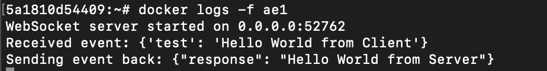
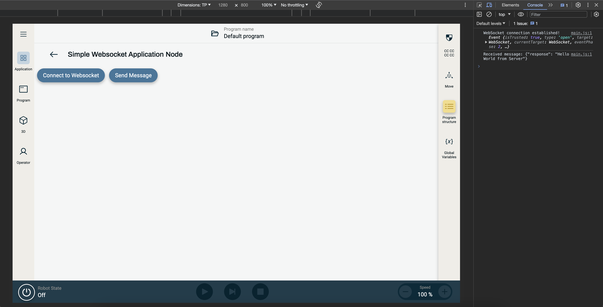

# Simple WebSocket Sample

This project is an example of how to use websocket based communication inside a URCap Contribution between the Docker backend and the Web frontend

### Dependencies
To install the dependencies of the project:

`$ npm install`

### Build
To build contribution type:

`$ npm run build`

### Installation
To install the built URCap in the simulator:

`$ npm run install-urcap`

## Backend Contribution
The backend contribution uses Python 3.11 with the `websockets` library ([official documentation](https://websockets.readthedocs.io/en/stable/)) to host as server on a specific port. The server adress and port used when spinning up the server is passed to the python file as arguments from the Dockerfile (in the entrypoint).

### Debug Output from Backend

Having built and installed the URCap in the simulator you can  open your terminal to see the output from the backend:

`$ docker exec web-simulator-runtime-1 bash`

From here find the ID of the backend contribution:

`$ docker ps`

With the ID (e.g. 8e3):

`$ docker logs -f ID`

E.g.:

## Frontend Contribution
The frontend contribution is built in Angular using no external libraries. It has an application node that contains two buttons: one for connecting to the WebSocket server and one for sending a predefined message to the server.

### Debug Output from the Frontend
Having built and installed the URCap in the simulator navigate to localhost and go into the Simple Websocket Application Node:

(To see the console as visualised on the far right in this image press F12 in Google Chrome)

Pressing "Connect to Websocket" will print a message to the console. Likewise will pressing "Send Message".

